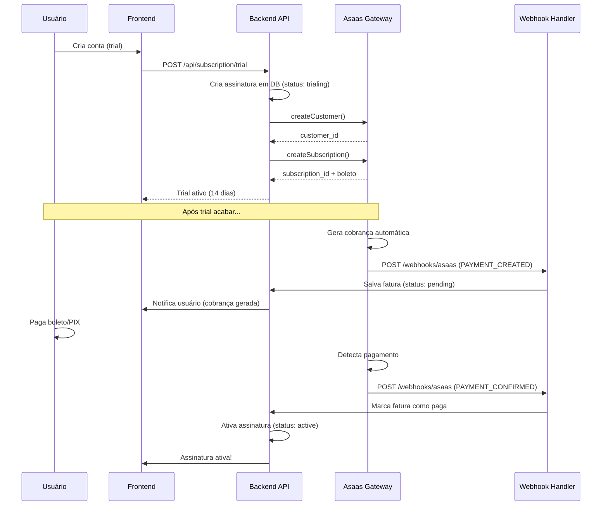

# 🚀 Setup da Integração Asaas (Gateway de Pagamento)

Este documento explica como configurar a integração com o Asaas para processar pagamentos no CFLOW Gestor.

---

## 📋 **Pré-requisitos**

1. Conta no Asaas (Criar em: https://www.asaas.com)
2. API Key do Asaas (Sandbox ou Produção)
3. Acesso ao painel Vercel (para configurar variáveis de ambiente)

---

## 🔑 **Passo 1: Obter API Key do Asaas**

### **Ambiente Sandbox (Testes)**

1. Acesse: https://sandbox.asaas.com
2. Faça login com sua conta
3. Vá em **Integrações** → **API Key**
4. Copie sua API Key (começa com `$aact_...`)

### **Ambiente Produção**

1. Acesse: https://www.asaas.com
2. Faça login
3. Vá em **Integrações** → **API Key**
4. Copie sua API Key de produção

---

## ⚙️ **Passo 2: Configurar Variáveis de Ambiente**

### **No Vercel (Produção)**

1. Acesse: https://vercel.com/dashboard
2. Selecione o projeto **cflow-gestor-backend**
3. Vá em **Settings** → **Environment Variables**
4. Adicione estas variáveis:

```env
ASAAS_API_KEY=<SUA_API_KEY_AQUI>
ASAAS_API_URL=https://sandbox.asaas.com/api/v3
```

**⚠️ Importante:**
- Para **testes**: use `https://sandbox.asaas.com/api/v3`
- Para **produção**: use `https://www.asaas.com/api/v3`

5. Clique em **Save**
6. Faça **Redeploy** do backend

### **Local (Desenvolvimento)**

Adicione no arquivo `/backend/.env`:

```env
# Asaas Gateway de Pagamento
ASAAS_API_KEY=sua_api_key_sandbox
ASAAS_API_URL=https://sandbox.asaas.com/api/v3
```

---

## 🔗 **Passo 3: Configurar Webhooks no Asaas**

Os webhooks permitem que o Asaas notifique automaticamente quando um pagamento é confirmado, vencido, etc.

### **3.1. Configurar URL do Webhook**

1. Acesse o painel do Asaas
2. Vá em **Integrações** → **Webhooks**
3. Clique em **Adicionar Webhook**
4. Configure:
   - **URL:** `https://cflow-gestor-backend.vercel.app/api/webhooks/asaas`
   - **Autenticação:** Nenhuma (público)
   - **Eventos:** Marque todos relacionados a pagamento:
     - ✅ PAYMENT_CREATED
     - ✅ PAYMENT_UPDATED
     - ✅ PAYMENT_CONFIRMED
     - ✅ PAYMENT_RECEIVED
     - ✅ PAYMENT_OVERDUE
     - ✅ PAYMENT_DELETED
     - ✅ PAYMENT_REFUNDED
5. Clique em **Salvar**

### **3.2. Testar Webhook**

```bash
curl -X POST https://cflow-gestor-backend.vercel.app/api/webhooks/health
```

Deve retornar:
```json
{
  "status": "ok",
  "message": "Webhook endpoint funcionando",
  "timestamp": "2026-01-12T..."
}
```

---

## 🧪 **Passo 4: Testar a Integração**

### **4.1. Verificar se está configurado**

```bash
curl https://cflow-gestor-backend.vercel.app/api/plans
```

Deve listar os 3 planos disponíveis.

### **4.2. Criar Trial (requer autenticação)**

```bash
curl -X POST https://cflow-gestor-backend.vercel.app/api/subscription/trial \
  -H "Authorization: Bearer SEU_TOKEN" \
  -H "Content-Type: application/json"
```

### **4.3. Simular Pagamento (Sandbox)**

No ambiente sandbox do Asaas, você pode:

1. Criar um boleto de teste
2. Marcar como "pago" manualmente no painel
3. O webhook será disparado
4. A assinatura será ativada automaticamente

---

## 📊 **Fluxo de Pagamento Completo**



---

## 🎯 **Métodos de Pagamento Suportados**

### **1. Boleto Bancário**
- Vencimento: 3 dias após geração
- Multa: 2% após vencimento
- Juros: 1% ao mês

### **2. PIX**
- QR Code gerado automaticamente
- Pagamento instantâneo
- Confirmação em tempo real

### **3. Cartão de Crédito**
- Link de pagamento seguro
- Sem armazenamento de dados do cartão
- Confirmação imediata

---

## 🔄 **Ciclo de Assinatura**

1. **Trial (14 dias):** Status `trialing`
   - Acesso completo ao plano Básico
   - Sem cobrança

2. **Cobrança Gerada:** Webhook `PAYMENT_CREATED`
   - Boleto/PIX disponível
   - Fatura com status `pending`

3. **Pagamento Confirmado:** Webhook `PAYMENT_CONFIRMED`
   - Assinatura ativa: Status `active`
   - Acesso liberado

4. **Renovação Automática:**
   - Todo mês no mesmo dia
   - Nova cobrança gerada automaticamente
   - Webhook notifica

5. **Pagamento Vencido:** Webhook `PAYMENT_OVERDUE`
   - Assinatura: Status `past_due`
   - Acesso pode ser bloqueado após X dias

6. **Cancelamento:**
   - Usuário cancela
   - Assinatura: Status `cancelled`
   - Acesso até o fim do período pago

---

## 🛠️ **Funções Disponíveis no Service**

```javascript
import asaasService from './services/asaasService.js';

// Criar cliente
const customer = await asaasService.createOrGetCustomer({
  nome: 'Empresa LTDA',
  email: 'empresa@example.com',
  cpfCnpj: '12345678000190',
  telefone: '11999999999'
});

// Criar assinatura recorrente
const subscription = await asaasService.createSubscription(
  customer.id,
  planoData,
  empresaData
);

// Criar pagamento único (boleto)
const payment = await asaasService.createPayment(
  customer.id,
  99.90,
  'Upgrade para plano Profissional'
);

// Gerar PIX
const pixPayment = await asaasService.createPixPayment(
  customer.id,
  99.90,
  'Plano Profissional - Mensal'
);

// Cancelar assinatura
await asaasService.cancelSubscription(subscriptionId);

// Verificar status de pagamento
const status = await asaasService.checkPaymentStatus(paymentId);
```

---

## 📝 **Logs e Depuração**

### **Ver Logs no Vercel**

1. Acesse: https://vercel.com/dashboard
2. Selecione **cflow-gestor-backend**
3. Vá em **Deployments** → Último deploy → **Function Logs**
4. Procure por:
   - `📨 Webhook Asaas recebido`
   - `✅ Fatura marcada como paga`
   - `🎉 Assinatura ativada`

### **Ver Webhooks no Asaas**

1. Painel Asaas → **Integrações** → **Webhooks**
2. Clique em **Histórico**
3. Veja todas as tentativas de envio
4. Status: Success (200) ou Error

---

## ⚠️ **Troubleshooting**

### **Webhook não está sendo recebido**

1. Verifique se a URL está correta no painel Asaas
2. Teste manualmente: `curl -X POST https://cflow-gestor-backend.vercel.app/api/webhooks/health`
3. Veja logs no Vercel

### **Pagamento não ativa assinatura**

1. Verifique logs: `📨 Webhook Asaas recebido`
2. Confirme que o evento é `PAYMENT_CONFIRMED`
3. Verifique se a fatura existe no banco

### **API Key inválida**

```
❌ Erro: 401 Unauthorized
```

Solução:
1. Verifique se `ASAAS_API_KEY` está configurada no Vercel
2. Confirme que está usando a chave correta (sandbox vs produção)
3. Faça redeploy após alterar variáveis

---

## 🔐 **Segurança**

✅ **Boas Práticas Implementadas:**
- API Key nunca exposta no frontend
- Webhooks salvos no banco para auditoria
- Todos os eventos registrados com timestamp
- Validação de company_id em todas as operações
- HTTPS obrigatório

⚠️ **Não Implementado (TODO):**
- Validação de assinatura do webhook (HMAC)
- Rate limiting específico para webhooks
- Retry automático de webhooks falhados

---

## 📚 **Documentação Oficial**

- **Asaas API:** https://docs.asaas.com
- **Webhooks:** https://docs.asaas.com/docs/webhooks
- **Assinaturas:** https://docs.asaas.com/reference/assinaturas
- **Pagamentos:** https://docs.asaas.com/reference/cobrancas

---

## ✅ **Checklist de Deploy**

- [ ] API Key configurada no Vercel
- [ ] ASAAS_API_URL configurada (sandbox ou produção)
- [ ] Webhook configurado no painel Asaas
- [ ] Teste de health do webhook: `curl /api/webhooks/health`
- [ ] Backend deployado com sucesso
- [ ] Trial criado com sucesso via API
- [ ] Webhook recebido e processado nos logs
- [ ] Assinatura ativada após pagamento

---

**🎉 Pronto! Sua integração com Asaas está completa e funcionando!**
