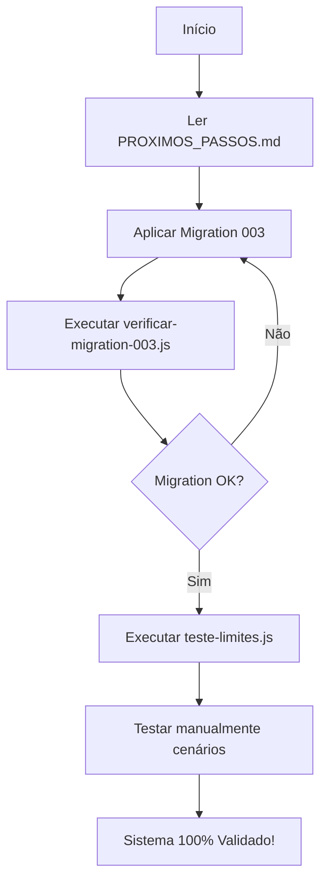

# 📚 Índice Completo - Documentação do Sistema de Limites

## 🎯 Início Rápido

**Novo no projeto?** Comece aqui: **[PROXIMOS_PASSOS.md](PROXIMOS_PASSOS.md)** ⭐

---

## 📖 Documentação Disponível

### 1. Documentos Principais

#### 📋 [PROXIMOS_PASSOS.md](PROXIMOS_PASSOS.md) - **START HERE**
- ✅ O que foi feito
- 🎯 Próximo passo imediato (aplicar migration)
- 📋 Tarefas futuras
- 🔧 Comandos úteis
- **Tempo de leitura**: 5 minutos

#### 📊 [RESUMO_IMPLEMENTACAO_LIMITES.md](RESUMO_IMPLEMENTACAO_LIMITES.md)
- ✅ Status atual (90% completo)
- 📊 Arquitetura funcionando
- 🧪 Como testar o sistema
- ✅ Checklist de validação
- 🎯 Status por componente
- **Tempo de leitura**: 10 minutos

#### 🔍 [ANALISE_SISTEMA_LIMITES.md](ANALISE_SISTEMA_LIMITES.md)
- 🏗️ Arquitetura completa
- 📊 Diagrama de fluxo
- 💻 Código-fonte com explicações
- 📚 Referências técnicas
- **Tempo de leitura**: 15 minutos
- **Público**: Desenvolvedores

---

### 2. Guias de Aplicação

#### 🚀 [backend/database/migrations/COMO_APLICAR_MIGRATION_003.md](backend/database/migrations/COMO_APLICAR_MIGRATION_003.md)
- **Objetivo**: Aplicar migration no Supabase
- 📝 Passo a passo com screenshots
- ⚠️ Possíveis problemas e soluções
- ✅ Validação de sucesso
- **Tempo**: 5 minutos
- **Criticidade**: ALTA ⚠️

---

### 3. Scripts Automatizados

#### 🔧 [backend/scripts/verificar-migration-003.js](backend/scripts/verificar-migration-003.js)
```bash
node backend/scripts/verificar-migration-003.js
```
- ✅ Verifica se migration foi aplicada
- 📊 Valida estrutura do banco
- 🔍 Detecta problemas
- **Output**: Relatório colorido no terminal

#### 🧪 [backend/scripts/teste-limites.js](backend/scripts/teste-limites.js)
```bash
TEST_TOKEN=seu_token node backend/scripts/teste-limites.js
```
- 🧪 Testa todos os endpoints
- ⚡ Valida performance (cache)
- 📊 Gera relatório de aprovação
- **Tempo**: 30 segundos
- **Testes**: 15+ validações

---

### 4. Cenários de Teste

#### 🧪 [CENARIOS_TESTE_LIMITES.md](CENARIOS_TESTE_LIMITES.md)
- 10 cenários de teste detalhados
- ✅ Passo a passo para cada teste
- 📊 Matriz de testes
- 🐛 Troubleshooting
- **Público**: QA + Desenvolvedores

**Cenários incluídos:**
1. Visualizar limites no frontend
2. Bloqueio ao criar usuário além do limite
3. Bloqueio ao criar lead além do limite
4. Alerta visual quando ≥90%
5. Plano ilimitado (Enterprise)
6. Sincronização automática ao mudar plano
7. Validação prévia (endpoints)
8. Cache de performance
9. Super admin sem restrições
10. Assinatura vencida (OVERDUE)

---

### 5. Arquivos Técnicos

#### 🗄️ [backend/database/migrations/003_add_plan_limits_columns.sql](backend/database/migrations/003_add_plan_limits_columns.sql)
- Migration SQL completa
- Adiciona campos: `max_usuarios`, `max_leads`, `max_storage_gb`
- Atualiza trigger de sincronização
- Popula planos padrão

#### ⚙️ Código-Fonte Existente (Já Implementado)
- [`backend/src/middleware/checkSubscription.js`](backend/src/middleware/checkSubscription.js) - Middleware de enforcement
- [`backend/src/controllers/assinaturaController.js`](backend/src/controllers/assinaturaController.js) - Endpoints REST
- [`frontend/src/components/UsageIndicator.jsx`](frontend/src/components/UsageIndicator.jsx) - Componente visual

---

## 🗺️ Fluxo de Trabalho Recomendado



### Passo 1: Documentação Inicial (5 min)
1. Leia: [PROXIMOS_PASSOS.md](PROXIMOS_PASSOS.md)
2. Entenda: [RESUMO_IMPLEMENTACAO_LIMITES.md](RESUMO_IMPLEMENTACAO_LIMITES.md)

### Passo 2: Aplicar Migration (5 min)
3. Siga: [COMO_APLICAR_MIGRATION_003.md](backend/database/migrations/COMO_APLICAR_MIGRATION_003.md)
4. Execute: `node backend/scripts/verificar-migration-003.js`

### Passo 3: Testes Automatizados (2 min)
5. Execute: `TEST_TOKEN=... node backend/scripts/teste-limites.js`
6. Valide: 100% de aprovação

### Passo 4: Testes Manuais (15 min)
7. Siga: [CENARIOS_TESTE_LIMITES.md](CENARIOS_TESTE_LIMITES.md)
8. Valide: 10 cenários principais

### Passo 5: Análise Técnica (Opcional)
9. Aprofunde: [ANALISE_SISTEMA_LIMITES.md](ANALISE_SISTEMA_LIMITES.md)

---

## 📊 Estatísticas da Documentação

| Documento | Linhas | Tempo Leitura | Público |
|-----------|--------|---------------|---------|
| PROXIMOS_PASSOS.md | 250 | 5 min | Todos ⭐ |
| RESUMO_IMPLEMENTACAO_LIMITES.md | 300 | 10 min | Todos |
| ANALISE_SISTEMA_LIMITES.md | 450 | 15 min | Devs |
| CENARIOS_TESTE_LIMITES.md | 550 | 20 min | QA/Devs |
| COMO_APLICAR_MIGRATION_003.md | 150 | 5 min | DBA/Devs |
| verificar-migration-003.js | 180 | - | Script |
| teste-limites.js | 250 | - | Script |
| 003_add_plan_limits_columns.sql | 150 | - | SQL |
| **TOTAL** | **2,280** | **55 min** | - |

---

## 🎯 Documentação por Função

### 👨‍💼 Para Product Owners / Gestores
1. [PROXIMOS_PASSOS.md](PROXIMOS_PASSOS.md) - Visão geral do status
2. [RESUMO_IMPLEMENTACAO_LIMITES.md](RESUMO_IMPLEMENTACAO_LIMITES.md) - Funcionalidades e roadmap

### 👨‍💻 Para Desenvolvedores
1. [ANALISE_SISTEMA_LIMITES.md](ANALISE_SISTEMA_LIMITES.md) - Arquitetura técnica
2. [COMO_APLICAR_MIGRATION_003.md](backend/database/migrations/COMO_APLICAR_MIGRATION_003.md) - Deploy
3. Código-fonte: checkSubscription.js, assinaturaController.js, UsageIndicator.jsx

### 🧪 Para QA / Testers
1. [CENARIOS_TESTE_LIMITES.md](CENARIOS_TESTE_LIMITES.md) - Casos de teste
2. `teste-limites.js` - Testes automatizados

### 🗄️ Para DBAs
1. [003_add_plan_limits_columns.sql](backend/database/migrations/003_add_plan_limits_columns.sql) - Migration
2. [COMO_APLICAR_MIGRATION_003.md](backend/database/migrations/COMO_APLICAR_MIGRATION_003.md) - Guia de aplicação

---

## 🔍 Busca Rápida

### Procurando por...

**"Como aplicar a migration?"**
→ [COMO_APLICAR_MIGRATION_003.md](backend/database/migrations/COMO_APLICAR_MIGRATION_003.md)

**"O sistema está funcionando?"**
→ Execute: `node backend/scripts/verificar-migration-003.js`

**"Como testar tudo?"**
→ [CENARIOS_TESTE_LIMITES.md](CENARIOS_TESTE_LIMITES.md)

**"Qual o status atual?"**
→ [PROXIMOS_PASSOS.md](PROXIMOS_PASSOS.md)

**"Como funciona tecnicamente?"**
→ [ANALISE_SISTEMA_LIMITES.md](ANALISE_SISTEMA_LIMITES.md)

**"Onde estão os scripts?"**
→ `backend/scripts/`

**"Qual a arquitetura?"**
→ [ANALISE_SISTEMA_LIMITES.md](ANALISE_SISTEMA_LIMITES.md) - Seção "Arquitetura de Limites"

---

## 📞 Suporte e Contribuição

### Encontrou um erro na documentação?
1. Identifique o arquivo afetado
2. Abra uma issue ou corrija diretamente

### Quer adicionar mais testes?
1. Edite: [CENARIOS_TESTE_LIMITES.md](CENARIOS_TESTE_LIMITES.md)
2. Adicione em: `backend/scripts/teste-limites.js`

### Precisa de ajuda?
1. Revise: [ANALISE_SISTEMA_LIMITES.md](ANALISE_SISTEMA_LIMITES.md)
2. Execute: Scripts de verificação
3. Consulte: Código-fonte com comentários

---

## ✅ Checklist de Leitura

Use este checklist para garantir que leu tudo:

- [ ] PROXIMOS_PASSOS.md (obrigatório)
- [ ] RESUMO_IMPLEMENTACAO_LIMITES.md (recomendado)
- [ ] COMO_APLICAR_MIGRATION_003.md (antes de aplicar)
- [ ] Executei: verificar-migration-003.js
- [ ] CENARIOS_TESTE_LIMITES.md (antes de testar)
- [ ] Executei: teste-limites.js
- [ ] ANALISE_SISTEMA_LIMITES.md (para entender a fundo)

---

## 🎉 Conclusão

Você tem acesso a **7 documentos + 3 scripts** totalizando **2.280 linhas** de documentação técnica completa sobre o sistema de limites!

**Próxima ação**: [PROXIMOS_PASSOS.md](PROXIMOS_PASSOS.md) → Aplicar Migration 003 🚀
